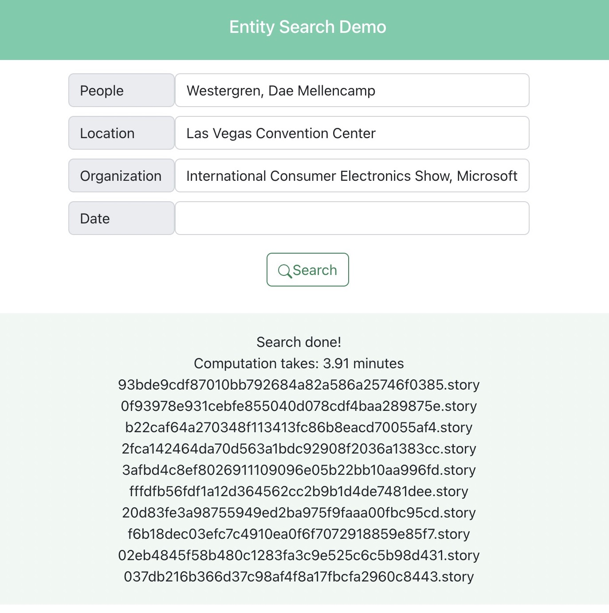

## Highlights
<pre>
entity-search/
    |-- api/venv/
        |-- compute_similarity.py
    |-- data/
        |-- tfidf/              -- entity tfidfs
        |-- metadata/
            |-- entity/         -- extracted entity
            |-- model_scores/   -- metrics of NLP tools
            |-- notebooks/      -- metadata codes
            |-- manual_label.csv
            |-- Search Engine Query.csv

</pre>

## Run Flask Server

<pre>
    . api/venv/bin/activate
    cd api
    flask run
</pre>

## Run Web App

<pre>
    yarn install
    yarn start
</pre>

Project worked by: Lina Li, Nuo Chen [@nuochen0818](https://github.com/nuochen0818), Qiaochu Dai [@Levi519519](https://github.com/Levi519519), Tian Cui [@TiannnC](https://github.com/TiannnC), Zexin Gong
